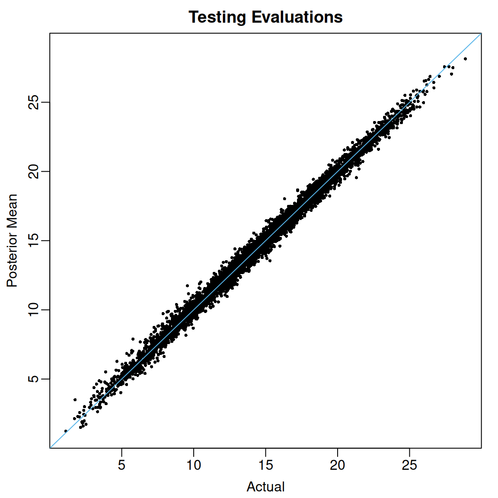
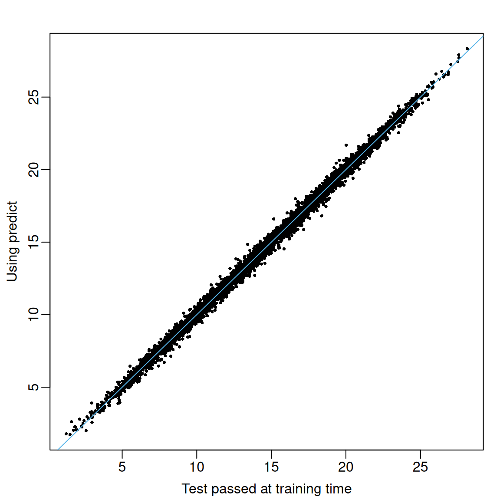

# Introduction to flexBART

**flexBART** is a new implementation of Bayesian Additive Regression
Trees (BART; [Chipman et
al. (2010)](https://doi.org/10.1214/09-AOAS285)) that introduces a new
formula interface and implements a lot of data pre-processing in an
effort to make it easier than ever to fit BART models. **flexBART** also
supports fitting (generalized) linear varying coefficient models, which
posit a linear relationship between the inverse link and some covariates
but allow that relationship to change as a function of other covariates,
and heteroskedastic BART models, in which both the mean and log-variance
are approximated with separate regression tree ensembles.

In this vignette, we demonstrate how to use **flexBART** to fit a basic
BART model in the standard nonparametric regression problem with
homoskedastic Gaussian errors.

## Setup

Suppose we observe $n$ pairs
$\left( \mathbf{x}_{1},y_{1} \right),\ldots,\left( \mathbf{x}_{n},y_{n} \right)$
of $p$-dimensional covariate vectors[¹](#fn1)
$\mathbf{x} \in \lbrack 0,1\rbrack^{p}$ and scalar outputs
$y \in {\mathbb{R}}.$

The basic BART model asserts that for each $i = 1,\ldots,n,$

$$y_{i}|f,\sigma \sim N\left( f\left( \mathbf{x}_{i} \right),\sigma^{2} \right),$$
where $f$ is the unknown regression function and $\sigma$ is the unknown
residual variance. At a high-level BART works by approximating $f$ as a
piecewise constant step-function, which it represents as a sum of
several binary regression trees. As a Bayesian method, BART specifies a
joint prior over the regression trees used to approximate $f$ and the
residual variance and then, based on the observed data, computes a joint
posterior distribution over the trees and $\sigma.$ Since the posterior
distribution is analytically intractable, posterior summaries are
computed using Markov chain Monte Carlo (MCMC). See [Chipman et
al. (2010)](https://doi.org/10.1214/09-AOAS285) for full details
details.

## Basic Usage

We will use a slightly modified version of the [Friedman
function](https://www.sfu.ca/~ssurjano/fried.html), which is often used
to check and benchmark BART implementations, to demonstrate the basic
usage of **flexBART**.

We begin by defining the Friedman function.

``` r
friedman_func <- function(df){
  if(ncol(df) < 5 ) stop("df must have at least 5 columns")
  if(!all(abs(df[,1:5]-0.5) <= 1)){
    stop("all entries in the first 5 columns of df must be between 0 and 1")
  } else{
    
    return(10*sin(pi*df[,1] * df[,2]) + 
           20 * (df[,3] - 0.5)^2 + 
           10 * df[,4] + 
           5 * df[,5])
  }
}
```

Although the function depends on only 5 covariates, for this
demonstration, we will create a total of $p = 50$ predictors, each drawn
uniformly from the interval $\lbrack 0,1\rbrack.$ We will also add
$N\left( 0,2.5^{2} \right)$ noise.

``` r
set.seed(724)
n_train <- 10000
p_cont <- 50
sigma <- 2.5

train_data <- data.frame(Y = rep(NA, times = n_train))
for(j in 1:p_cont) train_data[[paste0("X",j)]] <- runif(n_train, min = 0, max = 1)
mu_train <- friedman_func(train_data[,paste0("X",1:p_cont)])
train_data[,"Y"] <- mu_train + sigma * rnorm(n = n_train, mean = 0, sd = 1)
```

To fit a basic BART model to these data with **flexBART**, it suffices
to specify two arguments:

1.  The `formula` argument, which in this case should be `Y ~ bart(.)`
2.  The `train_data` argument, which should be a `data.frame` or
    `tibble` containing our data.

Like Stan[²](#fn2)By default, `flexBART` simulates 4 Markov chains for
2,000 iterations each and discards the first 1,000 iterations of each
chain as “burn-in”. You can adjust these values using the optional
`n.chains`, `nd`, and `burn` arguments.

``` r
fit <- 
  flexBART::flexBART(
    formula = Y~bart(.),
    train_data = train_data)
```

### Posterior Summaries

[`flexBART()`](https://skdeshpande91.github.io/flexBART/reference/flexBART.md)
always returns the posterior mean of the function evaluations
${\mathbb{E}}\left\lbrack f\left( \mathbf{x}_{i} \right)|\mathbf{y} \right\rbrack$
for each training observation $i = 1,\ldots,n.$ These posterior means
are contained in the `yhat.train.mean` attribute of
[`flexBART()`](https://skdeshpande91.github.io/flexBART/reference/flexBART.md)’s
output. The code below plots these posterior means against the actual
regression function evaluations contained in `mu_train`.

``` r
oi_colors <- palette.colors(palette = "Okabe-Ito")
limits <- range(c(mu_train, fit$yhat.train.mean))
par(mar = c(3,3,2,1), mgp = c(1.8, 0.5, 0))
plot(mu_train, fit$yhat.train.mean,
     pch = 16, cex = 0.5,
     xlim = limits, ylim = limits,
     xlab = "Actual", ylab = "Posterior Mean",
     main = "Training Evaluations")
abline(a = 0, b = 1, col = oi_colors[3])
```


Figure 1: Actual (horizontal) vs fitted (vertical) values of regression
function evaluated at training observations.

When the argument `save_samples = TRUE` (the default setting),
[`flexBART()`](https://skdeshpande91.github.io/flexBART/reference/flexBART.md)
will also return all posterior draws of the individual evaluations
$f\left( \mathbf{x}_{i} \right).$ Using these samples, we can compute,
for instance, 95% credible intervals for each
$f\left( \mathbf{x}_{i} \right)$.

``` r
post_quantiles <-
  apply(fit$yhat.train, MARGIN = 2, 
        FUN = quantile, 
        probs = c(0.025, 0.975)) |>
  t() |>
  as.data.frame()

mean( mu_train >= post_quantiles[,"2.5%"] & mu_train <= post_quantiles[,"97.5%"])
#> [1] 0.9775
```

For these data, the coverage of the pointwise 95% credible intervals is
97.75%.

### Variable Importance

Intuitively, we might expect the $j$-th covariate $X_{j}$ to be
predictive of the outcome $Y$ if $X_{j}$ is used as a splitting variable
at least once in the tree ensemble. We can operationalize this intuition
by computing marginal posterior inclusion probabilities of the form
$${\mathbb{P}}\left( X_{j}{\mspace{6mu}\text{used at least once}}|\mathbf{y} \right)$$
and then selecting only those $X_{j}$ whose marginal inclusion
probabilites exceed 50%.

The `varcount` attribute of flexBART()\`’s output contains an
three-dimensional array tracking the number of times each covariate is
used as a splitting variable in every MCMC iteration. The first
dimension indexes post-“burn-in” MCMC samples across the four chains and
the second dimension indexes the total number of covariates. The third
dimension indexes the total number of ensembles, which in this simple
example is just one.

``` r
dim(fit$varcounts)
#> [1] 4000   50    1
```

The code below shows how to compute the posterior inclusions
probabilities.

``` r
pip <- apply(fit$varcounts >= 1, MARGIN = c(2,3), FUN = mean)
rownames(pip)[which(pip >= 0.5)]
#> [1] "X1" "X2" "X3" "X4" "X5"
```

In this example, we see that the only variables with posterior inclusion
probabilities exceeding 50% are $X_{1},\ldots,X_{5}.$ Although
thresholding these marginal posterior inclusion probabilities is
somewhat ad hoc, we have found it to work rather well when used in
conjunction with [Linero
(2018)](https://doi.org/10.1080/01621459.2016.1264957) “DART” prior over
the splitting variable used in each decision rule. Briefly, if we let
$\theta_{j}$ denote the prior probability that a decision rule will be
based on the $j$-th covariate $X_{j},$ the DART prior places a
sparsity-inducing Dirichlet prior on the vector
${\mathbf{θ}} = \left( \theta_{1},\ldots,\theta_{p} \right).$[`flexBART()`](https://skdeshpande91.github.io/flexBART/reference/flexBART.md)
implements the DART prior by default but it can also be run with
constant prior splitting probabilities (i.e. each $\theta_{j} = 1/p$) by
setting the optional argument `sparse = TRUE`.

### Posterior Predictive Simulation

The attributes `yhat.train` and `yhat.train.mean` in the object returned
by
[`flexBART()`](https://skdeshpande91.github.io/flexBART/reference/flexBART.md)
contain the posterior draws and posterior mean of the function
evaluations. To draw from and to summarize the posterior predictive
distribution at each observed $\mathbf{x}_{i},$ one must add in
additional random noise. Specificially, given a posterior sample
$\left( f\left( \mathbf{x}_{i} \right),\sigma \right)$ we can form a
posterior predictive draw by computing
$f\left( \mathbf{x}_{i} \right) + \sigma\varepsilon^{\star}$ where
$\varepsilon^{\star}$ is drawn independently from a $N(0,1)$
distribution.

In the code below, we loop over all training observations and generate
draws from the corresponding posterior predictive distribution. Then, we
form 95% posterior predictive intervals and calculate the fraction of
observed outcomes that fall within these interval.s

``` r
nd <- nrow(fit$yhat.train)
ystar_train <- matrix(nrow = nd, ncol = n_train)
for(i in 1:n_train){
  ystar_train[,i] <- fit$yhat.train[,i] + rnorm(n = nd , mean = 0, sd = fit$sigma)
}

ystar_quantiles <- 
  apply(ystar_train, MARGIN = 2, 
        FUN = quantile, probs = c(0.025, 0.975)) |>
  t()
mean( train_data$Y >= ystar_quantiles[,"2.5%"] & train_data$Y <= ystar_quantiles[,"97.5%"])
#> [1] 0.959
```

At least for this example, we see that 95.9% of the observed $y_{i}$’s
fall within the predictive intervals.

## Making Predictions

So far, we have focused only on the posterior distribution of the
regression function evaluated at the observed covariates
$\mathbf{x}_{1},\ldots,\mathbf{x}_{n}.$ There are two ways to compute
the posterior distribution of regression function evaluations at new
values of the covariate vector
$\mathbf{x}_{1}^{\star},\ldots,\mathbf{x}_{N}^{\star}.$ To demonstrate
these options, we first create some test set observations

``` r
n_test <- 5000
test_data <- matrix(nrow = n_test, ncol = p_cont, dimnames = list(c(),paste0("X", 1:p_cont)))
for(j in 1:p_cont) test_data[,j] <- runif(n = n_test, min = 0, max = 1)
test_data <- as.data.frame(test_data)
mu_test <- friedman_func(test_data[,paste0("X",1:p_cont)])
```

### Option 1: Passing test data at training time

If these new inputs are available at training time (i.e., when we first
call
[`flexBART()`](https://skdeshpande91.github.io/flexBART/reference/flexBART.md)
to fit our model), we can pass these inputs to
[`flexBART()`](https://skdeshpande91.github.io/flexBART/reference/flexBART.md)
via the `test_data` argument. When we specify `test_data`,
[`flexBART()`](https://skdeshpande91.github.io/flexBART/reference/flexBART.md)
internally computes and stores the posterior samples of the regression
function evaluated at both the training data and testing data.

``` r
fit1 <-
  flexBART::flexBART(formula = Y~bart(.), 
                     train_data = train_data,
                     test_data = test_data)
```

Here is a plot of the posterior means
${\mathbb{E}}\left\lbrack f\left( \mathbf{x}_{i}^{\star} \right)|\mathbf{y} \right\rbrack$
against the actual values $f\left( \mathbf{x}_{i}^{\star} \right).$

``` r
limits <- range(c(mu_test, fit1$yhat.test.mean))
par(mar = c(3,3,2,1), mgp = c(1.8, 0.5,0))
plot(mu_test, fit1$yhat.test.mean, 
     pch = 16, cex = 0.5,
     xlim = limits, ylim = limits, main = "Testing Evaluations",
     xlab = "Actual", ylab = "Posterior Mean")
abline(a = 0, b = 1, col = oi_colors[3])
```



Figure 2: Actual (horizontal) vs fitted (vertical) values of regression
function evaluated at testing observations.

### Option 2 (Recommended): Using `predict()`

**flexBART** implements its own prediction method
([`predict.flexBART()`](https://skdeshpande91.github.io/flexBART/reference/predict.flexBART.md)),
which can be accessed through the generic
[`predict()`](https://rdrr.io/r/stats/predict.html). This method takes
two inputs: (i) `object`, which should be the full object returned by
[`flexBART()`](https://skdeshpande91.github.io/flexBART/reference/flexBART.md)
and (ii) `newdata`, which is a `data.frame` or `tibble` containing test
set observations. To demonstrate, we

``` r
fit2 <-
  flexBART::flexBART(formula = Y~bart(.), 
                     train_data = train_data)

train_preds <- predict(object = fit2, newdata = train_data)
```

As a sanity check, we can compare the posterior samples of the
$f\left( \mathbf{x}_{i} \right)$’s computed during the MCMC simulation
to the ones obtained using
[`predict()`](https://rdrr.io/r/stats/predict.html).

``` r
range(fit2$yhat.train - train_preds)
#> [1] -3.161915e-13  3.339551e-13
```

In this case, the difference is within tolerable numerical precision.

We can also plot the posterior means on the test data from the two
different approaches. We see that they are very closely aligned.

``` r
test_preds <- predict(object = fit2, newdata = test_data)
par(mar = c(3,3,2,1), mgp = c(1.8, 0.5, 0))
plot(fit1$yhat.test.mean, colMeans(test_preds), pch = 16, cex = 0.5,
     xlab = "Test passed at training time", ylab = "Using predict")
abline(a = 0, b = 1, col = oi_colors[3])
```



Figure 3

------------------------------------------------------------------------

1.  In fact, **flexBART** supports both numerical and categorical
    inputs. See
    [](https://skdeshpande91.github.io/flexBART/articles/categorical.qmd)

2.  See [this
    post](https://discourse.mc-stan.org/t/why-are-4-chains-used/7670)
    explaining why Stan uses these defaults.
