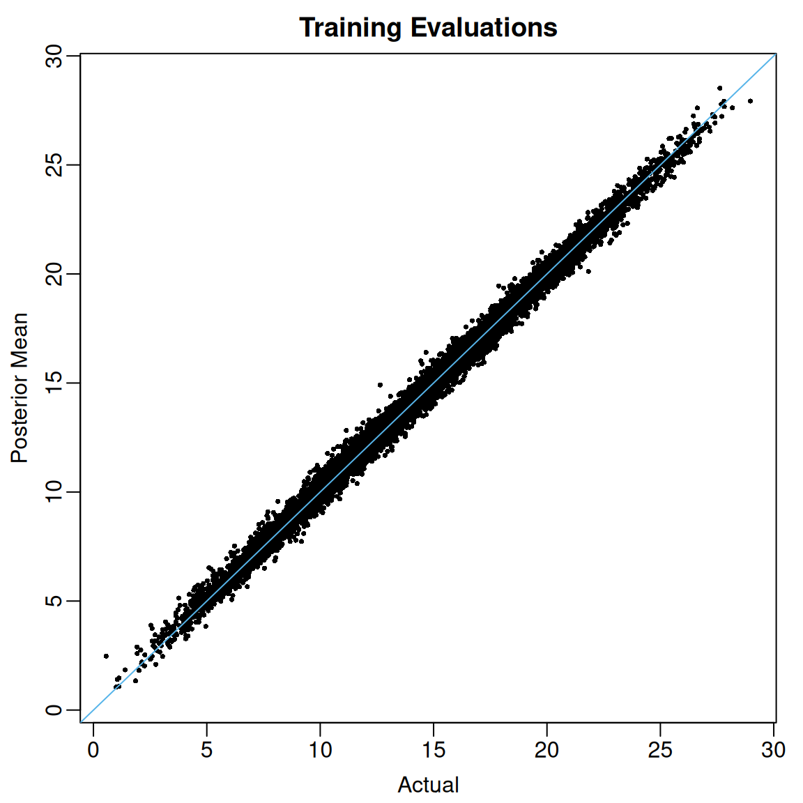

# Introduction to flexBART

## Basic Usage

We will demonstrate the basic functionality of **flexBART** using a
slightly modified version of the [Friedman
function](https://www.sfu.ca/~ssurjano/fried.html), which is often used
to check and benchmark BART implementations.

We begin by defining the Friedman function.

``` r
friedman_func <- function(df){
  if(ncol(df) < 5 ) stop("df must have at least 5 columns")
  if(!all(abs(df[,1:5]-0.5) <= 1)){
    stop("all entries in the first 5 columns of df must be between 0 and 1")
  } else{
    
    return(10*sin(pi*df[,1] * df[,2]) + 
           20 * (df[,3] - 0.5)^2 + 
           10 * df[,4] + 
           5 * df[,5])
  }
}
```

Although the function depends on only 5 covariates, for this
demonstration, we will create a total of $p = 50$ predictors, each drawn
uniformly from the interval $\lbrack 0,1\rbrack.$ We will also add
$\mathcal{N}\left( 0,2.5^{2} \right)$ noise.

``` r
set.seed(724)
n_train <- 10000
p_cont <- 50
sigma <- 2.5

train_data <- data.frame(Y = rep(NA, times = n_train))
for(j in 1:p_cont) train_data[[paste0("X",j)]] <- runif(n_train, min = 0, max = 1)
mu_train <- friedman_func(train_data[,paste0("X",1:p_cont)])
train_data[,"Y"] <- mu_train + sigma * rnorm(n = n_train, mean = 0, sd = 1)
```

The basic BART model asserts that for each observation $i = 1,\ldots,n,$
we have
$$y_{i}|f,\sigma \sim \mathcal{N}\left( f\left( \mathbf{x}_{i} \right),\sigma^{2} \right).$$
To fit this model to these data using
[`flexBART()`](https://skdeshpande91.github.io/flexBART/reference/flexBART.md),
it suffices to specify two arguments:

1.  The `formula` argument, which in this case should be `Y ~ bart(.)`
2.  The `train_data` argument, which should be a `data.frame` or
    `tibble` containing our data.

Like Stan[¹](#fn1)By default, `flexBART` simulates 4 Markov chains for
2,000 iterations each and discards the first 1,000 iterations of each
chain as “burn-in”. You can adjust these values using the optional
`n.chains`, `nd`, and `burn` arguments.

``` r
fit <- 
  flexBART::flexBART(
    formula = Y~bart(.),
    train_data = train_data)
```

### Posterior Summaries

[`flexBART()`](https://skdeshpande91.github.io/flexBART/reference/flexBART.md)
will always output the posterior mean of the function evaluations
$E\left\lbrack f\left( \mathbf{x}_{i} \right)|\mathbf{y} \right\rbrack$
for each training observation $i = 1,\ldots,n.$ These posterior means
are contained in the `yhat.train.mean` attribute of
[`flexBART()`](https://skdeshpande91.github.io/flexBART/reference/flexBART.md)’s
output.

``` r
oi_colors <- palette.colors(palette = "Okabe-Ito")
limits <- range(c(mu_train, fit$yhat.train.mean))
par(mar = c(3,3,2,1), mgp = c(1.8, 0.5, 0))
plot(mu_train, fit$yhat.train.mean,
     pch = 16, cex = 0.5,
     xlim = limits, ylim = limits,
     xlab = "Actual", ylab = "Posterior Mean",
     main = "Training Evaluations")
abline(a = 0, b = 1, col = oi_colors[3])
```



Figure 1: Actual (horizontal) vs fitted (vertical) values of regression
function evaluated at training observations.

When the argument `save_samples = TRUE` (the default setting), it will
also return all posterior draws of the individual evaluations
$f\left( \mathbf{x}_{i} \right).$ Using these samples, we can compute,
for instance, 95% credible intervals for each
$f\left( \mathbf{x}_{i} \right)$. For these data, the coverage of the
pointwise 95% credible intervals is 97.75%.

``` r
post_quantiles <-
  apply(fit$yhat.train, MARGIN = 2, 
        FUN = quantile, 
        probs = c(0.025, 0.975)) |>
  t() |>
  as.data.frame()

mean( mu_train >= post_quantiles[,"2.5%"] & mu_train <= post_quantiles[,"97.5%"])
#> [1] 0.9775
```

### Variable Importance

By default,
[`flexBART()`](https://skdeshpande91.github.io/flexBART/reference/flexBART.md)
uses [Linero (2018)](https://doi.org/10.1080/01621459.2016.1264957)
“DART” prior over the splitting variable.

The attribute `varcounts` returned by
[`flexBART()`](https://skdeshpande91.github.io/flexBART/reference/flexBART.md)
contains an three-dimensional array tracking the number of times each
covariate is used as a splitting variable in every MCMC iteration. The
first dimension indexes post-“burn-in” MCMC samples across the four
chains and the second dimension indexes the total number of covariates.
The third dimension indexes the total number of ensembles, which in this
simple example is just one.

``` r
dim(fit$varcounts)
#> [1] 4000   50    1
```

Intuitively, we might expect the $j$-th covariate $X_{j}$ to be
predictive of the outcome $Y$ if $X_{j}$ is used as a splitting variable
at least once in the tree ensemble. We can operationalize this intuition
by computing marginal posterior inclusion probabilities of the form
$${\mathbb{P}}\left( X_{j}{\mspace{6mu}\text{used at least once}}|\mathbf{y} \right)$$
and then selecting only those $X_{j}$ whose marginal inclusion
probabilites exceed 50%.

``` r
pip <- apply(fit$varcounts >= 1, MARGIN = c(2,3), FUN = mean)
rownames(pip)[which(pip >= 0.5)]
#> [1] "X1" "X2" "X3" "X4" "X5"
```

### Posterior Predictive

The attributes `yhat.train` and `yhat.train.mean` in the object returned
by
[`flexBART()`](https://skdeshpande91.github.io/flexBART/reference/flexBART.md)
contain the posterior draws and posterior mean of the function
evaluations. To draw from and to summarize the posterior predictive
distribution at each observe $\mathbf{x}_{i},$ one must add in
additional random noise. Specifically, given posterior samples
$\left( f^{(1)}\left( \mathbf{x}_{i} \right),\sigma^{(1)} \right)\ldots,\left( f^{(M)}\left( \mathbf{x}_{i} \right),\sigma^{(M)} \right),$
the $m$-th draw from the posterior predictive distribution of
$Y_{i}^{\star}|\mathbf{y}$ is formed by (i) drawing an independent
realization $\varepsilon_{i}^{\star{(m)}} \sim \mathcal{N}(0,1)$ and
(ii) computing
$f^{(m)}\left( \mathbf{x}_{i} \right) + \sigma^{(m)}\varepsilon^{\star{(m)}}.$

In the code below, we loop over all training observations and generate
draws from the corresponding posterior predictive distribution. Then, we
form 95% posterior predictive intervals and calculate the fraction of
observed outcomes that fall within these interval.s At least for this
example, we see that 95.94% of the observed $y_{i}$’s fall within the
predictive intervals.

``` r
nd <- nrow(fit$yhat.train)
ystar_train <- matrix(nrow = nd, ncol = n_train)
for(i in 1:n_train){
  ystar_train[,i] <- fit$yhat.train[,i] + rnorm(n = nd , mean = 0, sd = fit$sigma)
}

ystar_quantiles <- 
  apply(ystar_train, MARGIN = 2, 
        FUN = quantile, probs = c(0.025, 0.975)) |>
  t()
mean( train_data$Y >= ystar_quantiles[,"2.5%"] & train_data$Y <= ystar_quantiles[,"97.5%"])
#> [1] 0.959
```

------------------------------------------------------------------------

1.  See [this
    post](https://discourse.mc-stan.org/t/why-are-4-chains-used/7670)
    explaining why Stan uses these defaults.
