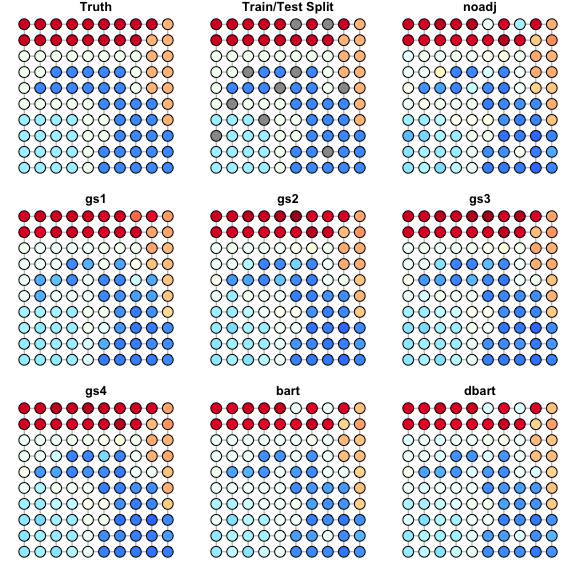

Estimating a piecewise-constant signal on the 2d lattice
================
2023-05-12

## Overview

In this example, we show how to use `flexBART::networkBART` to estimate
a piecewise-constant signal on a 2d lattice. To really highlight the
ability of **flexBART** to incorporate network-structure, in this
example we will not have any covariates. That is, at vertex

in the network, we will observe

noisy realizations of a constant
:
")
for

Our goal will be to recover the vector
.")

In this experiment, we will hold out all data from 10% of the vertices.
The idea is to see how well `flexBART::networkBART` is able to predict

at these vertices. Note that when we train our model, we will give it
the full network. In this way, our prediction task can be viewed as
\`\`in-fill’’ rather predicting at a previously unobserved vertex in the
network.

## Data Generation

We will start by creating our network, separating the vertices into five
clusters, and setting the value of

in each cluster.

``` r
library(igraph)
```

    ## 
    ## Attaching package: 'igraph'

    ## The following objects are masked from 'package:stats':
    ## 
    ##     decompose, spectrum

    ## The following object is masked from 'package:base':
    ## 
    ##     union

``` r
n_side <- 10
n <- 100

g <- make_lattice(length = n_side, dim = 2)
A <- as_adjacency_matrix(g, type = "both", sparse = FALSE)

# make up 5 clusters
cluster1 <- 81:100
cluster1 <- cluster1[!cluster1 %in% c(89,90, 100)]
cluster2 <- c(89, 90, 100, 79, 80, 69, 70, 59, 60, 50, 40)
cluster3 <- rep(1:4, times = 4) + 10 * rep(0:3, each = 4) # lower 4x4 grid
cluster4 <- c(52, 53,63,54, 64, 55,65,56, 66,46, 
              47, 57, 67, 37, 38, 48, 28, 29, 27, 
              17, 16, 18, 6, 7, 8,30, 20, 10, 9, 19, 39, 49)
cluster5 <- which(!1:100 %in% c(cluster1, cluster2, cluster3, cluster4))

cluster_means <- c(7.5, 3, -2, -5, 0)
mu <- rep(NA, times = n)
mu[cluster1] <- cluster_means[1]
mu[cluster2] <- cluster_means[2]
mu[cluster3] <- cluster_means[3]
mu[cluster4] <- cluster_means[4]
mu[cluster5] <- cluster_means[5]
```

Here is a plot of the
’s.

``` r
col_list <- colorBlindness::Blue2DarkRed18Steps
my_colors <- c("#999999", "#E69F00", "#56B4E9", "#009E73", 
               "#F0E442", "#0072B2", "#D55E00", "#CC79A7")
g_true <- g
scaled_mu <- scales::rescale(mu, to = c(0,1), from = c(-8,8))
V(g_true)$color <- rgb(colorRamp(col_list, bias = 1)(scaled_mu)/255)
par(mar = c(1,3,3,1), mgp = c(1.8, 0.5, 0))
plot(g_true, layout = layout_on_grid, main = "True signal", vertex.label = "")
legend_seq <- seq(-0.5, 0.5, length = 500)
for(leg_ix in 1:499){
  rect(par("usr")[1]-0.08, legend_seq[leg_ix], par("usr")[1]-0.02, legend_seq[leg_ix+1],
       border = NA, col = rgb(colorRamp(col_list, bias = 1)((leg_ix-1)/500)/255))
}

rect(par("usr")[1] - 0.08, -1 * 0.5, par("usr")[1]-0.02, 1 * 0.5)
text(x = par("usr")[1]-0.2, y = 0.5* c(-1, -0.5, 0, 0.5, 1), labels = c(-8, -4, 0, 4, 8), xpd = TRUE)
text(x = par("usr")[1]-0.05, y = par("usr")[4] * 0.5, labels =expression(mu))
```


## Experimental Setup

Now that we have
,
we will generate

observations from each vertex.

``` r
sigma <- 1
t <- 10
set.seed(624)
Y_all <- rep(mu, each = t) + sigma * rnorm(n*t, mean = 0, sd = 1)

set.seed(129)
vertex_id_all <- rep(1:n, each = t)
test_vertices <- sample(1:n, size = floor(0.1 * n), replace = FALSE)
train_vertices <- (1:n)[-test_vertices]

train_index <- which(vertex_id_all %in% train_vertices)

Y_train <- Y_all[train_index]

vertex_id_train <- vertex_id_all[train_index]
vertex_id_test <- 1:n # make prediction at all nodes in network

rmse_train <- c("flexBART" = NA, "BART" = NA)
rmse_test <- c("flexBART" = NA, "BART" = NA)
timing <- c("flexBART" = NA, "BART" = NA)
```

To compare our results with **BART**, which cannot account for any
adjacency information, we need to create a big model matrix

``` r
df_all <- data.frame(X = factor(vertex_id_all))
X_bart_all <- dbarts::makeModelMatrixFromDataFrame(df_all, drop = FALSE)
X_bart_train <- X_bart_all[train_index,]
X_bart_test <- unique(X_bart_all)
```

We’re now ready to fit our models.

``` r
flex_time <- system.time(
  flex_fit <- 
    flexBART::network_BART(Y_train= Y_train,
                           vertex_id_train = vertex_id_train,
                           vertex_id_test = vertex_id_test,
                           A = A, graph_cut_type = 1, verbose = TRUE))

rmse_train["flexBART"] <- sqrt(mean( (mu[train_vertices] - flex_fit$yhat.test.mean[train_vertices])^2 ))
rmse_test["flexBART"] <- sqrt(mean( (mu[test_vertices] - flex_fit$yhat.test.mean[test_vertices])^2 ))
timing["flexBART"] <- flex_time["elapsed"]
```

``` r
bart_time <- system.time(
    bart_fit <- 
      BART::wbart(x.train = X_bart_train,
                  y.train = Y_train, x.test = X_bart_test, 
                  sparse = FALSE,
                  ndpost = 1000, nskip = 1000, printevery = 2001))
rmse_train["BART"] <- sqrt(mean( (mu[train_vertices] - bart_fit$yhat.test.mean[train_vertices])^2 ))
rmse_test["BART"] <- sqrt(mean( (mu[test_vertices] - colMeans(bart_fit$yhat.test)[test_vertices])^2 ))
timing["BART"] <- bart_time["elapsed"]
```

## Results

Here are the RMSEs on the training vertices and testing vertices.

``` r
print("RMSE over training vertices:")
print(round(rmse_train, digits = 3))
print("RMSE over held-out vertices:")
print(round(rmse_test, digits = 3))
```

    ## [1] "RMSE over training vertices:"
    ## flexBART     BART 
    ##    0.331    0.436 
    ## [1] "RMSE over held-out vertices:"
    ## flexBART     BART 
    ##    1.399    4.753

To get a better idea of the differences, we can plot the estimated
’s
from both implementation.

``` r
mu_lim <- c(-1,1) * max(abs(c(flex_fit$yhat.test.mean, bart_fit$yhat.test.mean, mu)))
g_flex <- g
g_bart <- g
g_heldout <- g

scaled_mu <- scales::rescale(mu, to = c(0,1), from = mu_lim)
scaled_flex <- scales::rescale(flex_fit$yhat.test.mean, to = c(0,1), from = mu_lim)
scaled_bart <- scales::rescale(bart_fit$yhat.test.mean, to = c(0,1), from = mu_lim)

V(g)$color <- rgb(colorRamp(col_list, bias = 1)(scaled_mu)/255)
V(g_flex)$color <- rgb(colorRamp(col_list, bias = 1)(scaled_flex)/255)
V(g_bart)$color <- rgb(colorRamp(col_list, bias = 1)(scaled_bart)/255)

V(g_heldout)$color <- rep(my_colors[1], times = n)
V(g_heldout)$color[test_vertices] <- my_colors[5]

par(mar = c(1,1,1,1), mgp = c(1.8, 0.5, 0), mfrow = c(2,2))
plot(g, layout= layout_on_grid, vertex.label = NA, main = "True signal")
plot(g_heldout, layout = layout_on_grid, vertex.label = NA,main = "Train/Test split")

plot(g_flex, layout = layout_on_grid, vertex.label = NA,main = "flexBART")
plot(g_bart, layout = layout_on_grid, vertex.label = NA,main = "BART")
```



We see that on the training vertices, BART can get pretty accurate
estimates of

However, because BART does not know how to leverage the adjacency
information, it is forced to make the same prediction at each of the
heldout vertices. Specifically, at the heldout vertices, BART predicts

to be about equal to the grand mean of the data


In contrast, **flexBART** is able to leverage the adjacency information
and make much more accurate predictions at the heldout vertices.
