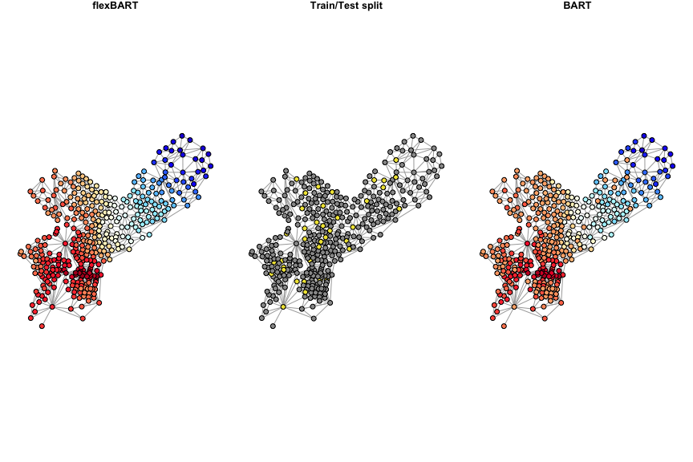

network_constant
================
2024-03-31

## Overview

In this example, we show how to use `flexBART::networkBART` to estimate
a smoothly-varying signal on a network. To really highlight the ability
of **flexBART** to incorporate network-structure, in this example we
will not have any covariates. That is, at vertex

in the network, we will observe

noisy realizations of a constant
:
")
for

Our goal will be to recover the vector
.")

We will simulate data on a real network that encodes the spatial
adjacencies of the 2010 Census tracts in the city of Philadelphia. In
all there are 384 census tracts. The file `tract_adjacency.RData`
contains an **igraph** object containing this network and a nice layout
for plotting as well as the adjacency matrix for this network.

``` r
library(igraph)
```

    ## 
    ## Attaching package: 'igraph'

    ## The following objects are masked from 'package:stats':
    ## 
    ##     decompose, spectrum

    ## The following object is masked from 'package:base':
    ## 
    ##     union

``` r
load("tract_adjacency.RData")
```

## Data Generation

We will generate the
’s
using the following three steps: 1. Create two connected clusters (`cl1`
and `cl2`) containing a handful of vertices. 2. For all vertices,
compute the shortest path distances between that vertex and each of
`cl1` and `cl2`. Denote these distances

and

3. Set
/(d_{i1} + d_{i2})").

In this way,

will be equal to 5 for all vertices

contained in cluster 1; will be equal to -5 for all vertices

contained in cluster 2; and will interpolate between the two extremes
for all remaining vertices.

``` r
n <- nrow(A_tract)
cluster1 <- 
  paste0("tr.",
         c(4.01, 4.02, 7, 8.01, 8.03, 8.04,
           12.01, 12.02, 369, 88.01, 88.02, 5, 1,
           6, 9.01, 9.02, 10.01, 10.02, 11.01, 11.02))


cluster2 <- 
  paste0("tr.",
         c(365.01, 359, 358, 357.01, 357.02, 365.02, 360,
           364, 361, 9803, 355, 356.01, 356.02,
           363.01, 363.03, 363.02, 362.01, 362.02, 362.03))

cluster3 <- rownames(A_tract)[!rownames(A_tract) %in% c(cluster1, cluster2)]

dist_to_cl1 <- apply(igraph::distances(graph = g, to = cluster1),
                     FUN = min, MARGIN = 1)
dist_to_cl2 <- apply(igraph::distances(graph = g, to = cluster2),
                     FUN = min, MARGIN = 1)
total_dist <- dist_to_cl1 + dist_to_cl2

mu <- 5 * dist_to_cl2/total_dist + -5 * dist_to_cl1/total_dist
```

Here is a plot of the
’s.

``` r
scaled_mu <- scales::rescale(mu, to = c(0,1), from = c(-5,5))
col_list <- colorBlindness::Blue2DarkRed18Steps
my_colors <- c("#999999", "#E69F00", "#56B4E9", "#009E73", 
               "#F0E442", "#0072B2", "#D55E00", "#CC79A7")
               
V(g)$color <- rgb(colorRamp(col_list, bias = 1)(scaled_mu)/255)

par(mar = c(1,3,3,1), mgp = c(1.8, 0.5, 0))
plot(g, layout = tract_layout, vertex.label = NA,
     vertex.size = 4)


legend_seq <- seq(-0.5, 0.5, length = 500)
for(leg_ix in 1:499){
  rect(par("usr")[1]-0.08, legend_seq[leg_ix], par("usr")[1]-0.02, legend_seq[leg_ix+1],
       border = NA, col = rgb(colorRamp(col_list, bias = 1)((leg_ix-1)/500)/255))
}

rect(par("usr")[1] - 0.08, -1 * 0.5, par("usr")[1]-0.02, 1 * 0.5)
text(x = par("usr")[1]-0.2, y = 0.5* c(-1, -0.5, 0, 0.5, 1), labels = c(-5, -2.5, 0, 2.5, 5), xpd = TRUE)
text(x = par("usr")[1]-0.05, y = par("usr")[4] * 0.5, labels =expression(mu))
```

<!-- -->

## Experimental Setup

Now that we have
,
we will generate

observations from each vertex. To make things interesting, we will train
our models using data from only 90% of all vertices. We will interested
in understanding how well we can recover

when we (i) have observed data at vertex

and (ii) when we have not observed data at vertex
.
Note: when training our model, we will use the full adjacency
information. This way we can assess how well our model leverages the
adjacency structure to predict

at the held-out vertices.

We start by drawing 10 noisy realizations of

at each vertex and then creating a training/testing split of the
vertices.

``` r
sigma <- 1
t <- 10
set.seed(624)
Y_all <- rep(mu, each = t) + sigma * rnorm(n*t, mean = 0, sd = 1)

set.seed(129)
vertex_id_all <- rep(1:n, each = t)
test_vertices <- sample(1:n, size = floor(0.1 * n), replace = FALSE)
train_vertices <- (1:n)[-test_vertices]

train_index <- which(vertex_id_all %in% train_vertices)

Y_train <- Y_all[train_index]

vertex_id_train <- vertex_id_all[train_index]
vertex_id_test <- 1:n # make prediction at all nodes in network

rmse_train <- c("flexBART" = NA, "BART" = NA)
rmse_test <- c("flexBART" = NA, "BART" = NA)
timing <- c("flexBART" = NA, "BART" = NA)
```

To compare our results with **BART**, which cannot account for any
adjacency information, we need to create a big model matrix

``` r
df_all <- data.frame(X = factor(vertex_id_all))
X_bart_all <- dbarts::makeModelMatrixFromDataFrame(df_all, drop = FALSE)
X_bart_train <- X_bart_all[train_index,]
X_bart_test <- unique(X_bart_all)
```

We’re now ready to fit our models.

``` r
flex_time <- system.time(
  flex_fit <- 
    flexBART::network_BART(Y_train= Y_train,
                           vertex_id_train = vertex_id_train,
                           vertex_id_test = vertex_id_test,
                           A = A_tract, graph_cut_type = 1, verbose = TRUE, print_every = 100))

rmse_train["flexBART"] <- sqrt(mean( (mu[train_vertices] - flex_fit$yhat.test.mean[train_vertices])^2 ))
rmse_test["flexBART"] <- sqrt(mean( (mu[test_vertices] - flex_fit$yhat.test.mean[test_vertices])^2 ))
timing["flexBART"] <- flex_time["elapsed"]
```

``` r
bart_time <- system.time(
    bart_fit <- 
      BART::wbart(x.train = X_bart_train,
                  y.train = Y_train, x.test = X_bart_test, 
                  sparse = FALSE,
                  ndpost = 1000, nskip = 1000, printevery = 2001))
rmse_train["BART"] <- sqrt(mean( (mu[train_vertices] - bart_fit$yhat.test.mean[train_vertices])^2 ))
rmse_test["BART"] <- sqrt(mean( (mu[test_vertices] - colMeans(bart_fit$yhat.test)[test_vertices])^2 ))
timing["BART"] <- bart_time["elapsed"]
```

## Results

Here are the RMSEs on the training vertices and testing vertices.

``` r
print("RMSE over training vertices:")
print(round(rmse_train, digits = 3))
print("RMSE over held-out vertices:")
print(round(rmse_test, digits = 3))
print("Timing:")
print(round(timing, digits = 3))
```

    ## [1] "RMSE over training vertices:"
    ## flexBART     BART 
    ##    0.244    0.499 
    ## [1] "RMSE over held-out vertices:"
    ## flexBART     BART 
    ##    0.342    2.433 
    ## [1] "Timing:"
    ## flexBART     BART 
    ## 1111.737   27.930

To get a better idea of the differences, we can plot the estimated
’s
from both implementation. The left panel shows the posterior mean
estimates of

from **flexBART**, the middle panel shows the original network with the
held-out vertices highlighted in cyan, and the right panel shows the
posterior mean estiamtes of

from **BART**.

``` r
mu_lim <- c(-1,1) * max(abs(c(flex_fit$yhat.test.mean, bart_fit$yhat.test.mean, mu)))
g_flex <- g
g_bart <- g
g_heldout <- g

scaled_flex <- scales::rescale(flex_fit$yhat.test.mean, to = c(0,1), from = mu_lim)
scaled_bart <- scales::rescale(bart_fit$yhat.test.mean, to = c(0,1), from = mu_lim)

V(g_flex)$color <- rgb(colorRamp(col_list, bias = 1)(scaled_flex)/255)
V(g_bart)$color <- rgb(colorRamp(col_list, bias = 1)(scaled_bart)/255)

V(g_heldout)$color <- rep(my_colors[1], times = n)
V(g_heldout)$color[test_vertices] <- my_colors[5]

par(mar = c(1,1,1,1), mgp = c(1.8, 0.5, 0), mfrow = c(1,3))
plot(g_flex, layout = tract_layout, vertex.label = NA,
     vertex.size = 5, main = "flexBART")
plot(g_heldout, layout = tract_layout, vertex.label = NA,
     vertex.size = 5, main = "Train/Test split")
plot(g_bart, layout = tract_layout, vertex.label = NA,
       vertex.size = 5, main = "BART")
```



We see that on the training vertices, BART can get pretty accurate
estimates of

However, because BART does not know how to leverage the adjacency
information, it is forced to make the same prediction at each of the
heldout vertices. Specifically, at the heldout vertices, BART predicts

to be about equal to the grand mean of the data


In contrast, **flexBART** is able to leverage the adajency information
and make much more accurate predictions at the heldout vertices.
